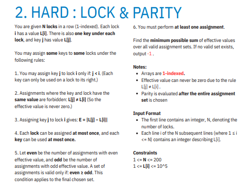

# 🔐 Lock & Parity Problem – Solution Walkthrough

This repository contains a solution to the **Lock & Parity assignment problem**.
The goal is to select valid key-lock assignments while minimizing the total cost and satisfying a **parity constraint**.

This README explains the thought process **from the most naive solution to the optimal approach**, just like a real problem-solving journey.

---

# 📘 Problem Summary

You are given **N locks** arranged in a row.

Each lock `i` has a value:

```
L[i]
```

Each lock also has **a key underneath it**.

A key from position `j` can unlock lock `i` if:

```
j < i
L[j] ≠ L[i]
```

The **cost** of assigning key `j` to lock `i` is:

```
|L[j] − L[i]|
```

---

# ⚠️ Constraints

```
1 ≤ N ≤ 200
1 ≤ L[i] ≤ 10^5
```

Rules:

* Each **key used at most once**
* Each **lock assigned at most once**
* At least **one assignment must exist**

---

# ⚖️ Parity Rule

After selecting assignments:

```
even_edges ≥ odd_edges
```

Where

```
even edge → cost is even
odd edge  → cost is odd
```

Examples:

| even | odd | valid |
| ---- | --- | ----- |
| 1    | 0   | ✅     |
| 1    | 1   | ✅     |
| 2    | 1   | ✅     |
| 0    | 1   | ❌     |
| 0    | 2   | ❌     |

Goal:

```
Minimize total assignment cost
```

Return **-1** if no valid assignment exists.

---

# 🧠 Approach 1 — Extreme Naive (Brute Force)

Idea:

1. Generate all possible assignments.
2. Try **every possible subset of assignments**.
3. Check:

   * keys not reused
   * locks not reused
   * parity rule satisfied
4. Compute minimum cost.

### Why it works

This explores **every possible combination**.

### Why it fails

Number of edges can reach ~20,000.

Total subsets:

```
2^20000
```

This is **computationally impossible**.

### Complexity

```
Time: O(2^E)
```

Where `E` = number of possible edges.

---

# 🧠 Approach 2 — Backtracking Matching

We improve brute force by:

* choosing edges recursively
* skipping invalid states early

We maintain:

```
used_keys[]
used_locks[]
even_count
odd_count
```

At every step we:

1. Pick an unused edge
2. Add it to the assignment
3. Continue recursively

Still, worst case remains exponential.

### Complexity

```
O(2^E)
```

Still too slow.

---

# 🧠 Approach 3 — Observing the Parity Rule

The key insight:

```
even_edges ≥ odd_edges
```

Meaning:

* odd edges alone ❌
* even edges alone ✅
* odd edges need even edges to balance them

Examples of valid sets:

```
1 even
1 even + 1 odd
2 even + 1 odd
2 even + 2 odd
```

This means **even edges stabilize odd edges**.

---

# 🧠 Approach 4 — Greedy Insight

Instead of testing assignments, we observe:

A **single even edge** already satisfies:

```
even = 1
odd  = 0
```

Which is valid.

So the smallest valid solution could be:

```
minimum even cost edge
```

But sometimes combining edges may also work.

Example:

```
1 even + 1 odd
```

---

# 🧠 Approach 5 — Practical Optimal Solution

Steps:

### 1️⃣ Generate all valid edges

For all `j < i`:

```
if L[j] ≠ L[i]
cost = |L[j] − L[i]|
```

---

### 2️⃣ Separate edges by parity

```
even_costs[]
odd_costs[]
```

---

### 3️⃣ Sort both lists

```
sort(even)
sort(odd)
```

---

### 4️⃣ Try valid combinations

Check:

```
1 even
1 even + 1 odd
2 even + 2 odd
...
```

Maintain:

```
even ≥ odd
```

Track the minimum cost.

---

# 💻 Final C++ Implementation

```cpp
#include <bits/stdc++.h>
using namespace std;

int main() {

    int N;
    cin >> N;

    vector<int> L(N);
    for(int i = 0; i < N; i++)
        cin >> L[i];

    vector<int> even, odd;

    for(int j = 0; j < N; j++) {
        for(int i = j + 1; i < N; i++) {

            if(L[j] == L[i]) continue;

            int cost = abs(L[j] - L[i]);

            if(cost % 2 == 0)
                even.push_back(cost);
            else
                odd.push_back(cost);
        }
    }

    sort(even.begin(), even.end());
    sort(odd.begin(), odd.end());

    long long ans = LLONG_MAX;

    if(!even.empty())
        ans = min(ans, (long long)even[0]);

    if(!even.empty() && !odd.empty())
        ans = min(ans, (long long)even[0] + odd[0]);

    int k = min(even.size(), odd.size());

    for(int i = 1; i <= k; i++) {

        if(i < even.size()) {

            long long sum = 0;

            for(int j = 0; j < i; j++)
                sum += odd[j];

            for(int j = 0; j < i; j++)
                sum += even[j];

            ans = min(ans, sum);
        }
    }

    if(ans == LLONG_MAX)
        cout << -1;
    else
        cout << ans;

}
```

---

# ⏱ Complexity

Generating edges:

```
O(N²)
```

Sorting:

```
O(E log E)
```

Where

```
E ≤ N²
```

For `N = 200`, this runs comfortably.

---

# 🌟 Final Insight

Odd assignments introduce imbalance.
Even assignments restore balance.

The optimal solution carefully chooses assignments so that:

```
imbalance never exceeds stability
```

Which is exactly the rule:

```
even_edges ≥ odd_edges
```

---

# 📂 Repository Structure

```
lock-parity-problem/
│
├── solution.cpp
├── README.md
└── testcases.txt
```

---

# 🚀 Author

Implemented as part of **algorithmic problem solving practice** and uploaded to GitHub for reference and learning.
